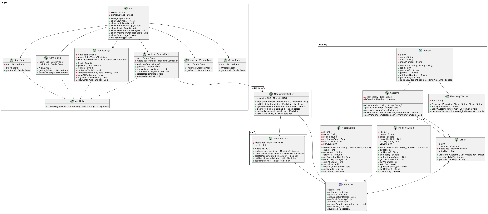

# 💊 PharmaSys – Pharmacy Management System

**PharmaSys** is a Java-based pharmacy management system developed as part of an advanced computer programming course project. It features a graphical user interface (GUI) and follows object-oriented programming (OOP) principles, including the use of classes, inheritance, polymorphism, exception handling, and unit testing.

---

## 🧭 Features Overview

PharmaSys operates in **two main modes**:

### 1. 🛠️ Admin Mode

Admin mode provides full control over the pharmacy’s databases. It includes **three separate databases** for:

- **Medicines**
- **Pharmacy Workers**
- **Customers**

#### Medicine Management Options:
1. **Add Medicine**
   - Inputs: Name, Type (Pills/Liquid), ID, Price, Expiration Date, Stock Quantity, Volume
2. **Update Medicine**
3. **Delete Medicine**
4. **View Single Medicine**
5. **View All Medicines**

### 2. 🧾 Service Mode

Service mode is used for customers to view and purchase medicines.

- Displays a **list of available medicines**
- Includes a **search bar** to find specific medicines
- When a medicine is **purchased**, its **stock quantity is decremented**
- If a medicine is **out of stock**, it will be labeled as such and cannot be purchased

---

## 🧪 Implementation Details

- Developed in **Java** using **OOP principles**
- GUI built using **Java Swing**
- Includes **exception handling** for invalid input and system errors
- **Unit testing** implemented to verify core functionalities

---

## 📐 UML Class Diagram

---

## 🎥 GUI Demo

<!-- Option 1: Link to YouTube -->

<!-- Option 2: Embed locally stored video (GitHub doesn't support direct playback, but users can download) -->
📽️ [Click here to watch the demo video](docs/demo.mp4)

---

## ✅ Technologies Used

- Java (OOP)
- JavaFX (GUI)
- JUnit (Unit Testing)

---

## 🚀 Getting Started

To run the application:

1. Clone the repository
2. Open in an IDE like IntelliJ IDEA or Eclipse
3. Build and run the project
4. Navigate through Admin Mode or Service Mode using the GUI

---

## 🙌 Contributors

- @Omar61554
- @mohamed-alaa32
- @MarwanMahmoud02
- @OmarEmad04
